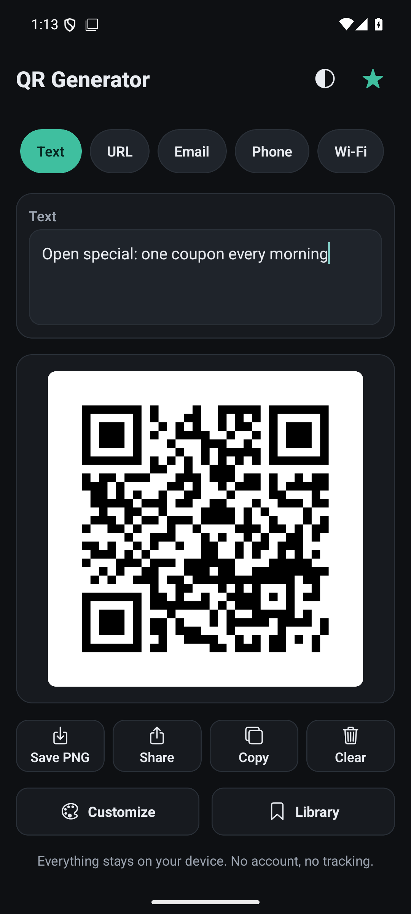
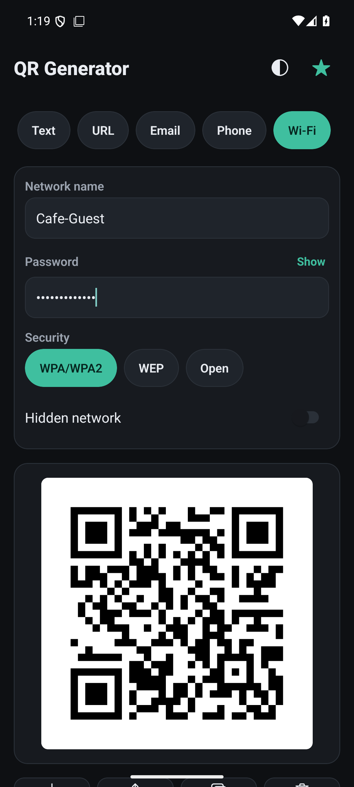
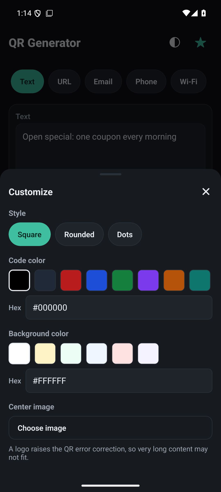

# QR Generator

An offline QR code generator for Android. Type something, get a code, save or
share it. Nothing you enter is sent anywhere.

Built with Expo (React Native + TypeScript). Package `com.qrgenerator.app`,
version 1.0.0.



> **Independent beta, not a Google Play release.**
> The APK is distributed directly from GitHub Releases. Android will ask you to
> allow installs from unknown sources. In this beta build **purchases are
> disabled and all premium features are unlocked** for testing. See
> [Beta status](#beta-status).

## QR types

| Type | You enter | Result |
|---|---|---|
| Text | Any text | Encodes it verbatim |
| URL | A link | Opens in the browser when scanned |
| Email | Address (subject/body optional) | Opens the mail composer |
| Phone | A number | Places a call |
| Wi-Fi | Network name, password, security (WPA/WEP/none), hidden-network flag | Phone camera offers to join the network |

The Wi-Fi form exists because it is the code people actually need at a counter:
a guest scans it with the stock camera app and joins, instead of retyping a
password.



## Features

Everything below is implemented in this repository, not planned.

- Five input types with live preview: the code redraws as you type
- Export as PNG through the Android folder picker, system share sheet, copy
  image to clipboard, clear/reset
- Three QR styles: square, rounded, dots
- Custom code and background colors
- Logo overlay in the centre of the code
- Saved codes and history, stored locally and deduplicated
- Dark, light and system theme, persisted between launches
- Premium tier: custom colors, styles, logo, unlimited saves, history
- Billing integration present but switched off in the beta build (see below)
- Accessible labels and roles on controls, Android back button closes sheets



## Privacy and offline behavior

Verified against the code in this repository:

- **No network calls.** There is no `fetch`, `XMLHttpRequest`, `axios` or
  WebSocket usage anywhere in the app source. Input never leaves the device.
- **No accounts, no analytics, no crash reporting, no ad SDK.**
- **Local storage only.** Saved codes, history and settings live in Android
  app storage (AsyncStorage) and are removed when you clear app data.
- **Permissions.** The manifest declares `INTERNET` and explicitly removes the
  camera, microphone, storage and overlay permissions that Expo templates add.
  The app requests no runtime permission. `INTERNET` exists for the development
  server and for the billing SDK, which the beta build does not initialize.
- The QR itself contains whatever you typed. A Wi-Fi code includes the network
  password in plaintext, by the nature of Wi-Fi QR codes. Anyone who can see
  the code can read it.

`PRIVACY_POLICY.md` is in the repository. **It still contains a placeholder
contact email** and must be edited before you host it anywhere public.

## Install the beta

Download (about 83 MB):

**[QR-Generator-beta-1.0.0.apk](https://github.com/angasko-12345/qr-generator/releases/download/beta-1.0.0/QR-Generator-beta-1.0.0.apk)**

Latest release: https://github.com/angasko-12345/qr-generator/releases

1. Download the APK and copy it to your Android phone, or download it directly
   on the phone.
2. Open the file. Android shows a prompt saying installs from this source are
   blocked. Tap **Settings**, allow your browser or file manager to install
   unknown apps, go back and confirm. You can revoke the permission afterwards.
3. Launch QR Generator. Requires Android 7.0 or newer.

Verify the file if you want to:

```
7485e3d98d58e4f7d6a2d9019a35d9267744d8e68f93285f603fa64d870a9f8b  QR-Generator-beta-1.0.0.apk
```

## Beta status

The beta configuration lives in `app.json` under `expo.extra.beta.enabled`.

- Premium features are unlocked for every tester, at no cost.
- Purchase and restore are switched off. No price is shown, no store is
  contacted, and a purchase request returns an honest "unavailable" result. The
  app never reports a payment that did not happen.
- The RevenueCat integration is untouched and still in the source, so real
  monetization can be switched back on later by flipping the flag and adding
  the key. `BETA.md` documents both directions.

This is a test build outside Google Play. It has not been reviewed by Google
or by anyone else.

## Known limitations

- **Android only.** No iOS target in this repository.
- **Generate only.** The app creates codes; it does not scan or decode them.
- **Beta cannot be purchased.** Premium is granted by configuration, not by a
  transaction. Store products are not exercised in this build.
- **Sideloaded signature.** The APK is signed with a local release key, not
  Play App Signing. If the app is ever published on Google Play, an install
  from Play and this APK will be mutually incompatible.
- **PNG export uses the folder picker.** Android asks you to choose a
  destination folder each time, instead of silently writing to the gallery.
- **Logo overlay can hurt scannability.** Large logos on dense codes reduce the
  distance and angle at which phones can read them.
- **Hobby project.** No security audit, no bug bounty, no guaranteed response
  time.

## Reporting bugs and giving feedback

Use the issue tracker: https://github.com/angasko-12345/qr-generator/issues

Include:

1. Your Android version and device model.
2. What you did, step by step.
3. What you expected and what happened instead.
4. A screenshot where you can. Please do not post your real Wi-Fi password;
   use a test network name.

Feedback on the Wi-Fi code is the most useful right now: does scanning it with
your phone's stock camera app actually join the network?

## Development

Requirements: Node.js 20+, npm, and for Android builds JDK 17+ with Android
SDK (platform 36, build-tools 36.0.0).

```bash
npm install

npm run typecheck             # tsc --noEmit
npm run lint                  # eslint .
npm test                      # jest unit tests

npx expo start                # dev server, scan with Expo Go
```

Build a release APK locally (no cloud service required):

```bash
npx expo prebuild -p android --no-install   # only if android/ is missing
bash scripts/setup_signing.sh               # creates a local keystore

cd android
export ANDROID_HOME=/path/to/android-sdk
sh gradlew :app:assembleRelease
```

Output: `android/app/build/outputs/apk/release/app-release.apk`

Keystores, keystore passwords, `local.properties`, `node_modules`, build
outputs and APK/AAB binaries are all ignored by `.gitignore`. Nothing in this
repository should ever contain a secret.

Project layout:

```
App.tsx                 main screen, sheets, export actions, toasts
app.json                Expo config, permissions, assets, beta flag
docs/                   landing page and screenshots
marketing/              draft launch material for approval
plugins/                config plugin: MainActivity launch mode
scripts/                asset generator, local signing setup
src/billing/            RevenueCat integration (off in beta)
src/components/         type selector, form, preview, action row
src/data/               local storage: saved codes, history, settings
src/premium/            entitlements, beta flag, premium context
src/qr/                 pure logic: parsing, QR matrix, styles
src/sheets/             Customize, Library, Premium sheets
src/theme/              design tokens and theme context
BETA.md                 how the beta configuration works
BILLING_SETUP.md        Play + RevenueCat setup for real monetization
PRIVACY_POLICY.md       privacy policy draft (contact email pending)
```

## Landing page

https://angasko-12345.github.io/qr-generator/ (GitHub Pages, served from
`docs/`).

## License

MIT. See `LICENSE`.
